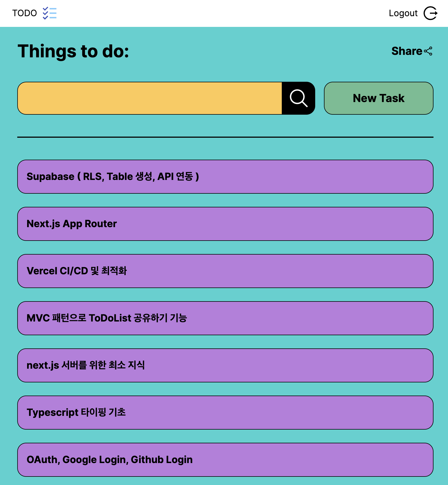
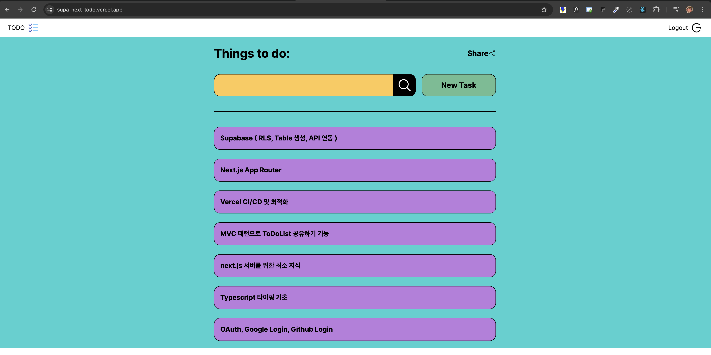

# 0.Supabase, Next 풀스택 시작하기 (feat. 슈파베이스 OAuth, nextjs 14)


## 1. 완성본 미리 보기

LiveDemo : https://supa-next-todo.vercel.app/  

### Mobile



### PC



## 2.TechStack & Tools

```
React 18
Next.js 14 AppRouter
TailwindCss
react-spinners
react-icons  
```

## 3.강의 필기 노트 안내  

강의필기노트📌 : https://dodokyo.github.io/docs/g-nextjs+supa/p0/supanext00  

- 각 챕터별 Goal : 강의 목표 안내  
- 각 챕터별 면접 연습 : 복습해야 할 주요 내용 안내    
- 각 챕터별 더 알아보기 (공식문서, 개념 등) : 더 공부할 문서 안내    
- 각 챕터별 고도화 : 성능개선 및 최적화 Point 안내  

## 4.공부 방법 🌼🌼🌼🌼

이 강의는 클론코딩이 메인 입니다.  
강의를 보면서 따라치는것도 좋지만, 그냥 보면서 이해하고 넘어가도 좋습니다.   
그러나 반드시 내것으로 만드는 체화 과정이 필요합니다.   

### 체화 

체화를 잘 끝내셨더라면 2가지가 머리속(혹은 노트)가 남습니다.  

1.각 핵심기술 컨셉에 대한 사용 목적, 사용 방법, 예시 코드, 참고 래퍼런스 등 핵심만 남기기 ( 자료로 뭐든 구현할 수 있어.! )  
2.핵심요약을 바탕으로 실제 사이드 프로젝트 해보기  


### 추천하는 방법 

1.강의를 빠르게 배속으로 본다.   
(이론적인 부분들은 완벽하지 않더라도 이해만 하고 넘어간다.)   
2.코딩 부분은 하나의 컴포넌트(구현체) 단위로 복습을 진행한다.  
3.일부의 컴포넌트(구현체)를 안보고 그대로 재현한다.  
4.재현에 필요한 개념들은 따로 정리해도 좋다.  

예)  
재현에 필요한 개념  
- flex, font-size, color, margin 등 css 개념   
- react component 만들기  
- next Image 컴포넌트 사용법  
- 아이콘 고르고 import하는 방법  

### 근본 원리 : 추상화와 구체화  

클론코딩뿐 아니라 타인의 지식을 내것으로 흡수하는데 일련의 과정이 있다.  
혹자는 이를 추상화와 구체화 과정, 나는 딥다이브 및 지식트리만들기 라고 표현한다.  
누군가는 Deep&Back 이라는 용어를 쓰기도 하고, 5Why 기법이라는 방식으로도 표출된다.  

Todo List 만드는 방법을 통해 공부방법을 손에 잡히게 전달드리고 싶다.    
- 강의를 통해서 TodoList를 만드는 법을 배웠다고 가정합니다.   
- 여기까지 강의를 듣고 만약 당신이 강의를 안보고 ToDoList를 만들 수 있겠는가?   
- 막 강의를 듣고 코드를 따라쳤다면 사실상 어렵다고 생각합니다.  

그러면 아래처럼 4단계로 생각을 세분화 하는것을 추천합니다.  

1.큰틀에서 목적 : Supabase로 TodoList 만들기  
2.주요 기능 Level : 사용자 입력, ToDo 생성, 수정, 삭제, 저장 기능 으로 한 단계 더 분석함.   
3.구현 로직 Level : 어떻게 구현 할 수 있는지 방법들을 분석함.  
4.최종 코드 Level : TodoListJS 코드  

```
1.큰틀에서 목적 (Supabase로 TodoList 만들기)을 바로 구현할 수 있으면 BEST!  
그렇지 않다면 아래 드릴 다운 과정으로 *내가 무엇을 이해하지 못했는지 정확히 파악하기*!!


예) 1.큰틀에서 목적 (Supabase로 TodoList 만들기) 에서 2.주요 기능 Level을 추출했다,  

ToDoList는 아래의 기능들로 세분화 가능  
1) 사용자의 입력 부분  
2) Todo 추가
3) Todo 업데이트 
4) Todo 삭제
5) Todo 보여주기(read)
6) Todo 저장 기능
```

```
예) 2.주요 기능 Level을 추출에서 3.구현 로직 Level으로 더 세분화 했다.  

1) 사용자의 입력 부분  
    - 1.1) html > input ( 사용자랑 인터렉션 가능 )  
    - 1.2) event 를 다뤄야할것 같음 ( 사용자의 키보드 엔터 감지 가능 ) input 요소에서 이벤트 발생 → JS함수 연결 가능   
    - 1.3) 화면을 갱신하는 기능 —- 위 이벤트와 연결, todoList html 코드 부분 업데이트 하자.   
    - 1.4) 저장기능 API 사용 —- 위 이벤트에 함수 더 붙이자.  
2) Todo 추가
    - 2.1) ... 
3) Todo 업데이트 
    - 3.1) ... 
4) Todo 삭제
    - 4.1) 삭제 기능의 button 요소를 todoList에 추가하자.  
    - 4.2) delete button 클릭 → 이벤트 → 함수 연결 ( onClickDelete, todo index넘겨야 함)
    - 4.3) onClickDelete 구현 > todoList 배열에서 index값을 찾아서 splice 하고 저장  
    - 4.4) todoList 화면갱신
5) Todo 보여주기(read)
6) Todo 저장 기능
```

위 2가지 예시를 보면서, ToDoList 하나 만드는데 분석해야 할 점들이 많다.  
- 2.주요 기능 Level 추출에서는 큰 틀에서 6개로 나누었다.  
- 3.구현 로직 Level 에서는 각 단계마다 4단계로 더 나누었다. (총 24단계의 작은 로직들 )  
- * 그렇다면 이렇게 까지 "분석"을 했다면, 이제 코드로 구현할 수 있어야 한다. 
- * 그렇지 않다면 더 분석하고, 내가 이해할 수 있도록 부분부분을 더 봐야 한다.   


## 5.강의 체크포인트 안내  

- 아래 브랜치를 통해서 각 챕터별 체크포인트를 확인할 수 있습니다.  

https://github.com/dodokyo/supa-next-todo/tree/ch4-done  
https://github.com/dodokyo/supa-next-todo/tree/ch5-done
https://github.com/dodokyo/supa-next-todo/tree/ch6-done
https://github.com/dodokyo/supa-next-todo/tree/ch7-done
https://github.com/dodokyo/supa-next-todo/tree/ch8-done
https://github.com/dodokyo/supa-next-todo/tree/ch9-done
https://github.com/dodokyo/supa-next-todo/tree/ch10-done
