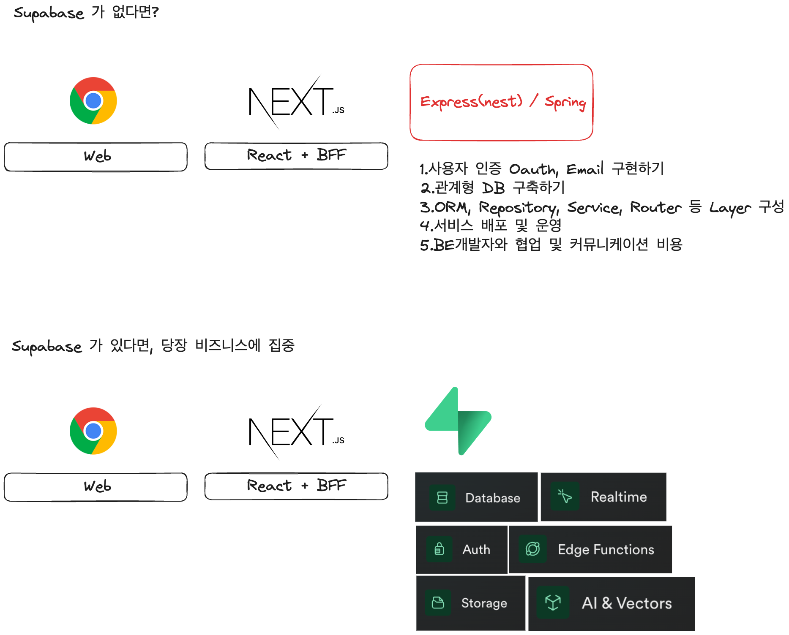
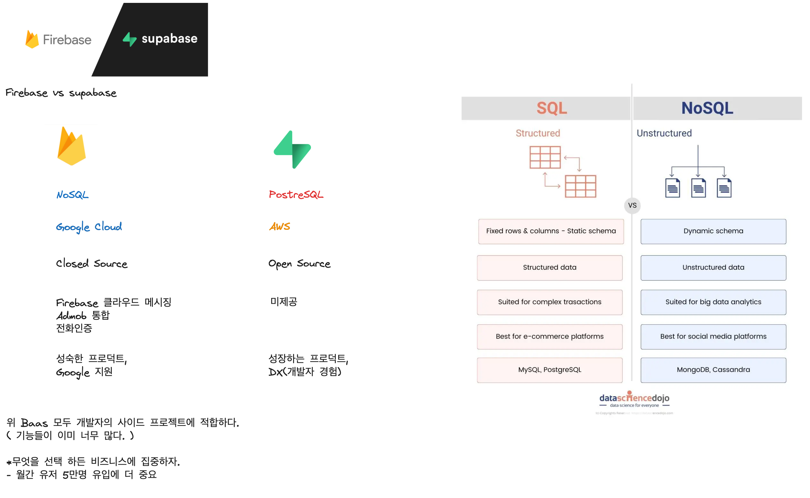
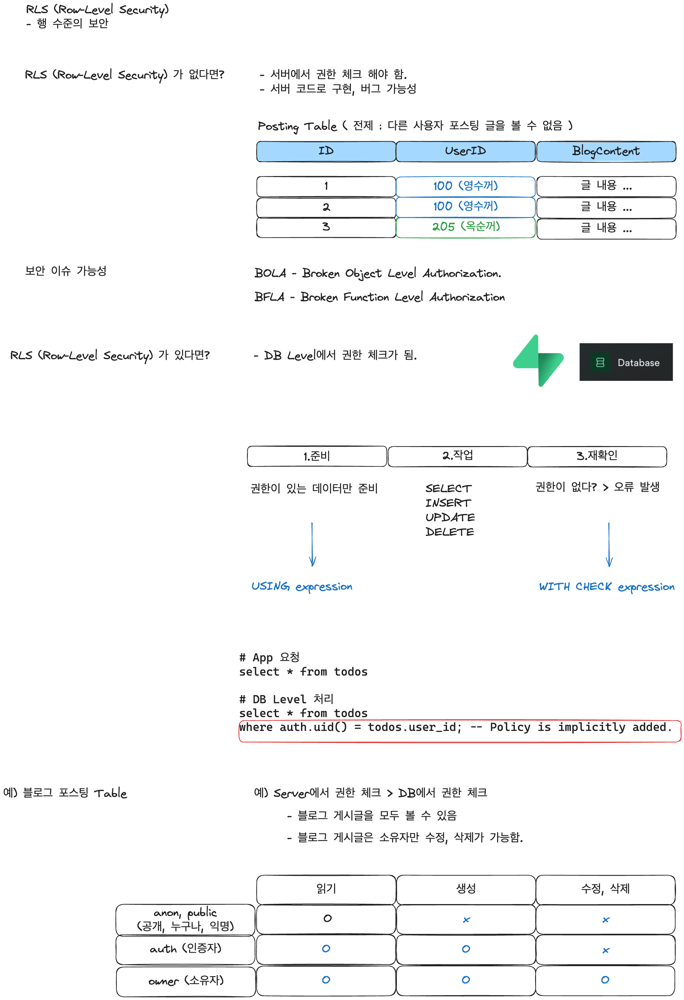
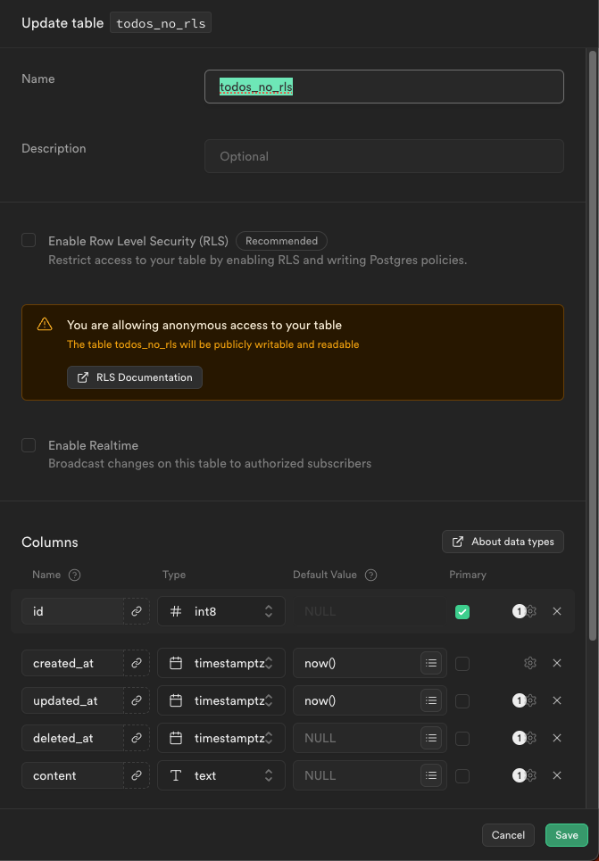

# 1.Supabase Concepts

Goal  
- Supabase를 서비스를 이해 합니다.  
- TodoList 테이블을 생성 및 데이터를 조회할 수 있습니다. 

## 1.Supabase 란 ?

>https://supabase.com/docs

Supabase : 프로젝트를 빠르게 구축하기 위한 백앤드 서비스들 모음집 + 클라우드 서비스 이다.  
- firebase의 NoSQL버전이라고 봐도 좋다.!  

### 6대 핵심 기능 

데이터베이스:
- Supabase는 각 프로젝트에 대해 전체적인 Postgres 데이터베이스를 제공하며 실시간 기능, 데이터베이스 백업, 확장 기능 등을 제공합니다.

인증(Auth):
- 이메일 및 비밀번호, 비밀번호 없는 인증, OAuth 및 모바일 로그인과 같은 다양한 인증 방법을 통해 프로젝트에 사용자를 추가하고 관리할 수 있습니다.

스토리지:
- 대용량 파일을 저장, 정리, 변환 및 제공할 수 있으며, 데이터베이스와 완전히 통합되어 Row Level Security 접근 정책을 사용할 수 있습니다.  

실시간:
- 데이터베이스 변경 사항을 실시간으로 감지하고, 사용자 상태를 클라이언트 간에 동기화하며, 채널에 구독된 클라이언트에게 데이터를 브로드캐스트할 수 있습니다.  

Edge Functions:
- 전 세계적으로 분산된 서버 측 함수를 통해 사용자에게 가장 낮은 지연 시간으로 코드를 실행할 수 있습니다.

AI 및 벡터:
- Supabase를 사용하여 임베딩 벡터를 저장하고 검색할 수 있습니다.  
  - Search: how similar is a search term to a body of text? 
  - Recommendations: how similar are two products?  
  - Classifications: how do we categorize a body of text?  
  - Clustering: how do we identify trends?  


## 2.Supabase는 든든한 백엔드 지원군  

```전후 비교 다이어 그램 ```  



## 3.Supabase vs Firebase  

```Supabase vs Firebase 비교 ```  



DB : 
- PostgreSQL 데이터베이스 : PostgreSQL은 대규모 엔터프라이즈 애플리케이션에서 수년 동안 사용되어 왔으며 많은 개발자의 신뢰를 받고 있습니다.  
- 반면 Firebase는 PostgreSQL만큼 유연하고 강력하지 않은 Cloud Firestore라는 NoSQL 문서 데이터베이스를 사용합니다.   

가격 : 
- Firebase가 Supabase보다 저렴합니다. Firebase 데이터베이스(Firestore)의 GB당 가격은 $0.108 이고 Supabase의 경우 $0.125/GB입니다.  
- *가격은 계속 변한다. 초기 10GB의 데이터베이스 스토리지, 10GB의 파일 스토리지 및 1GB의 대역폭 
- 500 MB database space (2 Core shared CPU • 1 GB RAM), 5 GB bandwidth, 1 GB file storage

오픈 소스 :   
- 먼저 Supabase는 오픈 소스 플랫폼으로 사용자가 소스 코드를 검토하고 수정할 수 있어 더 큰 투명성과 제어를 제공합니다. 반면에 Firebase는 제한된 맞춤설정 수준을 가진 독점 플랫폼입니다.  
- Supabase를 직접 내 서버에 구축할 수 있다. with Docker   

실시간 업데이트:
- Supabase와 Firebase는 모두 각자의 구독 시스템을 통해 실시간 업데이트를 제공합니다. 그러나 Supabase는 PostgreSQL에 내장된 LISTEN/NOTIFY 메커니즘을 사용하므로 Firebase의 실시간 데이터베이스에 비해 더 효율적이고 유연한 실시간 업데이트가 가능합니다.


ref : [Firebase와 Supabase: 어느 것을 선호해야 하며 그 이유는 무엇입니까?](https://medium.com/@bishtnarottam/firebase-vs-supabase-which-one-you-should-prefer-and-why-c3b2334c9604)  
[Supabase 또는 Firebase: 2023년 프로젝트에 적합한 도구는 무엇입니까?](https://www.linkedin.com/pulse/supabase-firebase-which-right-tool-your-project-2023-rahul-malik/)   
[파이어베이스를 쓰지 말아야 할 이유](https://blog.naver.com/raveneer/221002040963) 


## 4.Supabase의 가격 정책 Pricing  
> https://supabase.com/pricing

- 시작은 FREE 이다.!   
- DB의 용량을 500MB 혹은 1 GB file storage 혹은 MAU 5만 넘어가면, 이후 PRO 사용하면 된다.      

Free 버전에서 문제 
- 클라우드 리소스를 절약하기 위해 현재 7일 이상 비활성 상태인 무료 계층 프로젝트를 일시 중지하고 있습니다.  

그럼 유료 버전에서는 ?  
- 100,000 monthly active users 
- 8 GB database space 
- 250 GB bandwidth 
- 100 GB file storage 
- Email support
- Daily backups stored for 7 days
- 7-day log retention  

## 5.Supabase의 RLS (Row-Level Security)


Supabase의 RLS는 "Row-Level Security"의 약자. 
- 데이터베이스 테이블의 행에 대한 보안을 관리하는 기능
- 사용자 또는 역할이 특정 행에 접근할 수 있는지 여부를 제어.  

행 수준의 보안 장점   
- 블로그 포스팅이라는 테이블이 있다라고 가정 하면  
- 포스팅이라는 하나의 테이블에는 다른 사람들의 포스팅도 있음    
- 원래는 서버단에서 내 포스팅과 다른 사람의 포스팅이 섞이지 않도록 권한체크 해야 한다.     
- 근데 DB Level에서 이를 해주는 거임  
- 보안이 향상된 인프라가 있으니 맘놓고 개발 가능!   

예)  
- Todo테이블의 Todo 정보에 대해서 다음 규칙을 DB Level에서 적용 가능  
- 3가지 권한 타입 : owner(소유권자), auth(인증자) ,public(공개,anon 누구나, 익명)  
- 정책 만들기 예)
  - SELECT : Todo테이블은 읽기는 누구나 가능하다.  
  - UPDATE : Todo테이블은 수정은 로그인 한 사람은 누구나 가능하다.  
  - DELETE : Todo테이블 삭제는 만든사람만 가능하다.  

신기한 점  
- 로그인 후 + select * from post 라고 조회하면 로그인 한 사용자것만 나옴  
- sql이 실제랑 다르다.  

```js
# App 요청
select * from todos

# DB Level 처리
select * from todos
where auth.uid() = todos.user_id; -- Policy is implicitly added.
```
참조 : https://supabase.com/docs/guides/database/postgres/row-level-security#policies

### RLS 로 해결하는 API 취약점  

BOLA - Broken Object Level Authorization. 
- 접근 권한이 없는 데이터에 접근을 하는 경우이다.  
- 예를 들어, A 사용자는 자신의 정보만 볼 수 있어야 하는 데, 같은 권한 수준을 가진 B 사용자의 정보까지 볼 수 있는 경우를 말한다.  


BFLA - Broken Function Level Authorization
- BOLA가 Access - 데이터 접근에 대한 문제라면 BFLA는 Action - 작업 수행에 대한 문제이다. 즉, 권한이 없는 작업을 수행하는 것이다.

* postgreSQL의 RLS 기능을 이용해서 BOLA, BFLA 예방할 수 있다.  

### 📌 면접연습 - 알고있는 API 취약점에 대해서 설명하고, 이를 해결하는 방법을 말해주세요.  

ref : [11개 API 취약점](https://jusths.tistory.com/330)

## 6.Supabase 시작하기 (조직 만들기, 프로젝트 만들기)  

- Supabase는 조직단위로 사람들을 초대할 수 있어요.  
- 그 사람들과 함께 여러 프로젝트를 진행할 수 있죠.  

## 7.Todolist (with no RLS) 테이블 만들기  

  

Table Editor로 투두 리스트롤 만들어 보세요.  
- 각 필드에 대한 목적도 숙지가 되었나요?

## 8.Supbase TableEditor 사용해보기 with suapAI 

  

Todo 테이블에 대해서 CRUD 작업을 해보세요.!  
- SQL구문 없이 supabase 툴을 이용해서요. 


## 9.Supbase SQL Editor 사용해보기 

### 📌 면접연습 - CRUD 란 무엇이며, 기본적인 SQL 구문을 작성 해주세요.  

CRUD는 데이터베이스에서 자주 사용되는 네 가지 기본적인 작업을 나타냅니다: Create(생성), Read(읽기), Update(갱신), Delete(삭제). 각각의 작업은 데이터의 관리를 위해 사용됩니다.

1. **Create (생성)**:
   - `INSERT INTO` 문을 사용하여 데이터베이스 테이블에 새로운 레코드를 추가합니다.
   - 예를 들어, 새로운 사용자를 추가하려면 다음과 같이 SQL 문을 작성할 수 있습니다:
     ```sql
     INSERT INTO users (username, email) VALUES ('newuser', 'newuser@example.com');
     ```

2. **Read (읽기)**:
   - `SELECT` 문을 사용하여 데이터베이스에서 데이터를 조회합니다.
   - 예를 들어, 사용자의 정보를 조회하려면 다음과 같이 SQL 문을 작성할 수 있습니다:
     ```sql
     SELECT * FROM users WHERE username = 'newuser';
     ```

3. **Update (갱신)**:
   - `UPDATE` 문을 사용하여 데이터베이스의 기존 레코드를 수정합니다.
   - 예를 들어, 사용자의 이메일 주소를 업데이트하려면 다음과 같이 SQL 문을 작성할 수 있습니다:
     ```sql
     UPDATE users SET email = 'updated@example.com' WHERE username = 'newuser';
     ```

4. **Delete (삭제)**:
   - `DELETE` 문을 사용하여 데이터베이스에서 레코드를 삭제합니다.
   - 예를 들어, 사용자를 삭제하려면 다음과 같이 SQL 문을 작성할 수 있습니다:
     ```sql
     DELETE FROM users WHERE username = 'newuser';
     ```

```sql
-- R
select * from  todos_no_rls;
select * from todos_no_rls where deleted_at is null ;

-- C
insert into todos_no_rls (content) values  ('Add todos_no_rls content');

-- U
update todos_no_rls set content = 'Updated content' where  id = 2;
update todos_no_rls set deleted_at = now() where  id = 3;

-- D
delete from todos_no_rls where  id = 2;
```

## 10.DBeaver로 supabase connection 해보기

Supabase를 꼭 웹에서 관리하지 않아도 좋습니다.  
- 필요하다면 DB를 직접 connection해서 접속 할 수 있죠.   