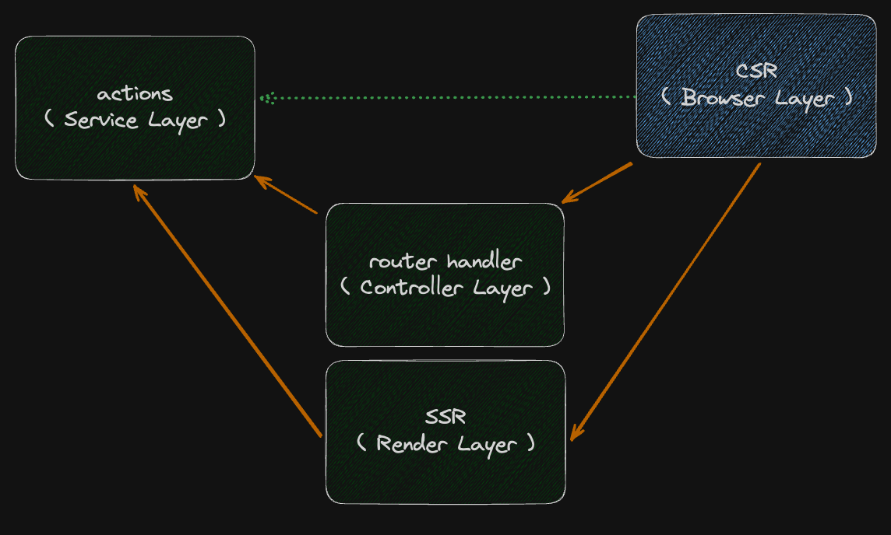

# 6.Next.js 14 서버를 위한 최소 지식

Goal  
- Next.js의 서버 기능 요소를 이해하고, TodoList를 CRUD 해볼 수 있습니다.    


## 1 Supabase serverClient  

우선 코드를 따라 치고 나중에 이해 해요.  

## 2 RouterHandler  

>>https://nextjs.org/docs/app/building-your-application/routing/route-handlers

## 3 RouterHandler (예) getTodoList API 만들기

## 4 Middleware 

>>https://nextjs.org/docs/app/building-your-application/routing/middleware


```js
import { NextResponse, NextRequest } from "next/server";

export function middleware(req: NextRequest) {
  const res = NextResponse.next();
  console.log("middleware pass : pathname ", req.nextUrl.pathname);

  return res;
}

export const config = {
  matcher: "/",
};

```

## 5 Middleware (예) 쿠키 카운터

### cookie 조작해보기 

- 쿠키란 ? 

쿠키는 웹 브라우저에 저장되는 작은 데이터 조각으로, 웹사이트가 브라우저를 통해 사용자의 컴퓨터에 정보를 저장하고 추적하는 데 사용됩니다. 이 정보는 사용자를 식별하거나 사용자의 활동을 추적하는 데 사용될 수 있습니다. 주로 세션 관리, 개인화, 사용자 트래킹 등의 목적으로 사용됩니다.  

- 브라우저에서 cookie 지우는 방법은?    

JavaScript를 사용하여 쿠키를 조작하는 방법은 다음과 같습니다:

1. **쿠키 설정**:
   - 쿠키를 설정하려면 `document.cookie` 속성을 사용합니다. 이 속성에는 문자열 형식으로 쿠키 정보가 포함되어 있습니다. 일반적으로 `name=value` 형식으로 쿠키를 설정하고, 필요한 경우 추가 옵션을 설정할 수 있습니다.

   ```javascript
   document.cookie = "cookieName=cookieValue; expires=Fri, 31 Dec 2022 23:59:59 GMT; path=/";
   ```

2. **쿠키 읽기**:
   - `document.cookie` 속성을 통해 현재 페이지에 설정된 모든 쿠키를 읽을 수 있습니다. 이 값을 파싱하여 특정 쿠키를 찾을 수 있습니다.

   ```javascript
   const cookies = document.cookie.split("; ");
   for (const cookie of cookies) {
       const [name, value] = cookie.split("=");
       console.log(name, value);
   }
   ```

3. **쿠키 삭제**:
   - 쿠키를 삭제하려면 해당 쿠키의 만료일을 과거의 날짜로 설정하면 됩니다. 만료일 이전의 쿠키는 브라우저에 의해 삭제됩니다.

   ```javascript
   document.cookie = "cookieName=; expires=Thu, 01 Jan 1970 00:00:00 GMT; path=/";
   ```

이 방법들을 사용하여 JavaScript로 쿠키를 설정, 읽기 및 삭제할 수 있습니다. 다만, 보안상의 이유로 중요한 데이터는 쿠키에 저장하지 않는 것이 좋습니다. 대신 서버 측 세션 저장소 또는 웹 스토리지 API (로컬 스토리지, 세션 스토리지)를 사용하는 것이 좋습니다.


- 미들웨어에서 조작하는 방법  

```
  request.cookies.delete("vercel");
  request.cookies.get("vercel");
  request.cookies.getAll();
  request.cookies.has("vercel");
  request.cookies.set("vercel", "slow");

  response.cookies.delete("vercel");
  response.cookies.get("vercel");
  response.cookies.getAll();
  response.cookies.has("vercel");
  response.cookies.set("vercel", "slow");
```


### cookie counter

```js
import { NextResponse, NextRequest } from "next/server";

export function middleware(request: NextRequest) {
  const response = NextResponse.next();

  if (request.cookies.get("cookie-counter")?.value) {
    const prev = request.cookies.get("cookie-counter")?.value;
    response.cookies.set("cookie-counter", `${Number(prev) + 1}`);
  } else {
    response.cookies.set("cookie-counter", "1");
  }

  return response;
}

export const config = {
  matcher: "/",
};

```


## 6 RSC (with use client)

>>https://nextjs.org/docs/app/building-your-application/rendering/server-components

## 7 ServerActions  

>>https://nextjs.org/docs/app/building-your-application/data-fetching/server-actions-and-mutations

## 8 Supabase serverClient 설명


## 9 ServerActions (예) getTodoList 액션 만들기

  

