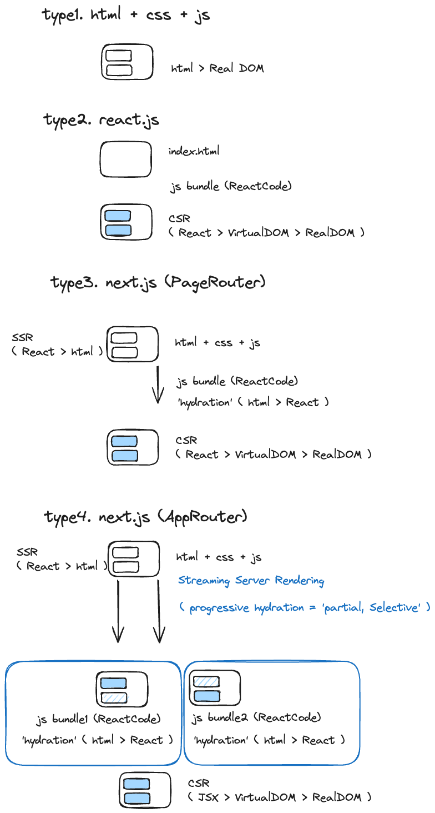
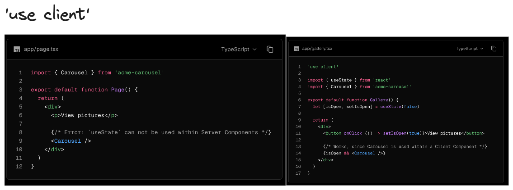
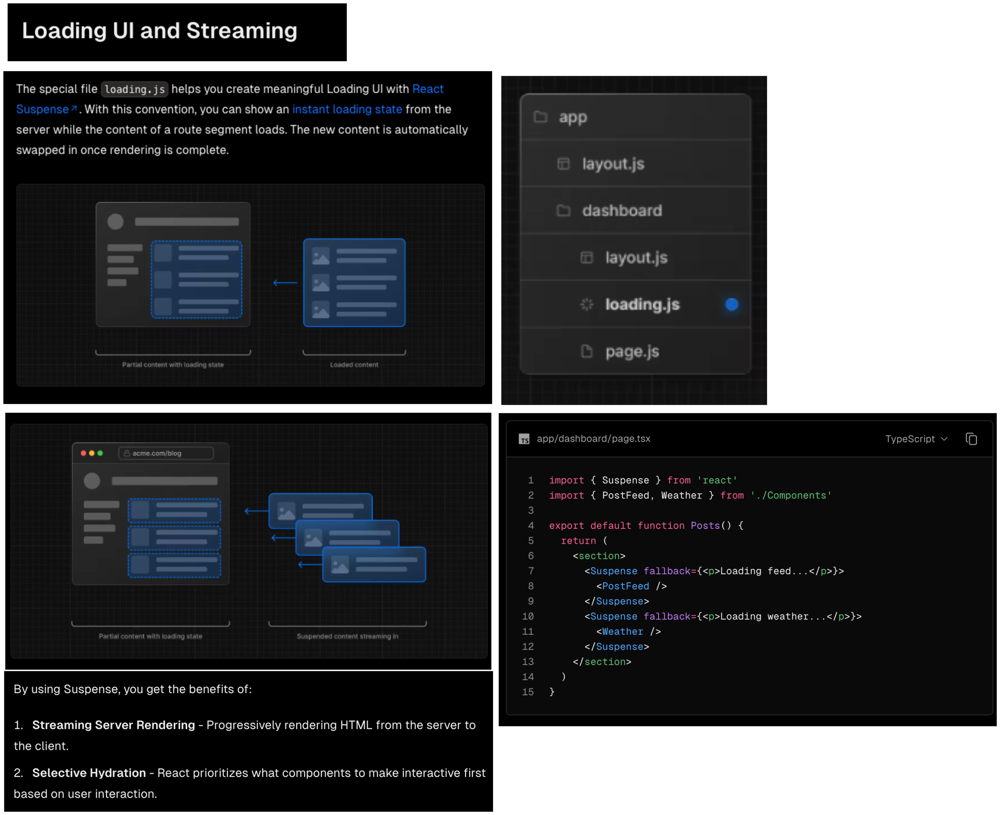

# 3.NextJS 핵심 개념 (이론)

## 3.1 HTML+CSS+JS vs React.js vs Next.js 차이점


HTML + CSS + Vanilla JS:
- 기본기 > 작은 프로젝트나 간단한 웹 페이지
- 단일 페이지 애플리케이션(SPA)을 구축 어렵
- 결과물 : HTML + CSS + JS
- 장점 : 가장 빠르다 
  - but, 큰 프로젝트 개발이 어렵다.  

React:
- SPA ( Single Page Application , Angular, Vue, React - 현재 FE 개발 트렌드, Svelte)
- 페이스북에서 만든 JavaScript 라이브러리
- 언제 사용 ? : SEO 상관없는 인터렉션이 많은 모든 웹 ( 어드민 페이지, B2B 페이지, Gmail, 지도 앱)
- 결과물 : JS 정적 파일 (+html, css)  
- 장점 : 웹에서 앱처럼 UI상호작용이 가능한 웹사이트 개발 가능, 
  - but, SEO 불리 및 초기 JS로딩이 느리다. ( 빈 화면 보임 ) 

Next.js:
- MPA ( Mutiple Page Application )
- React 기반의 서버 사이드 렌더링(SSR) 및 정적 사이트 생성(Static Site Generation, SSG)을 지원하는 프레임워크입니다.  
- 언제사용 ? :
  - SEO 최적화
  - 초기 로딩 속도 향상 > B2C  
- FullStack 가능 ( 서버 API, DB 조회 등 )
- 결과물 : 서버 Application ( + html 정적 파일)
  - but, 웹 + 서버 전반의 지식 필요 

## 3.2 랜더링 종류 - CSR, SSR, Hydration



## 3.3 컴포넌트 종류 - RSC, RCC, use client




## 3.4 React Suspense ( Streaming, Progressive Hydration )




## 3.5 TailwindCSS 정리1

## 3.6 TailwindCSS 정리2

## 3.7 TailwindCSS 정리3 - 예제


---

## NextJS 란?	


## 랜더링의 종류 (CSR, SSR, hydration)


### RSC,RCC,'use client'

> https://nextjs.org/docs/app/building-your-application/rendering/composition-patterns#when-to-use-server-and-client-components
- 2개 비교하기
- 언제 사용하는가
- 'use client'의 진정한 의미  


### React Suspense ( Loading UI and Streaming )
> https://nextjs.org/docs/app/building-your-application/routing/loading-ui-and-streaming#example

*Selective Hydration을 가능하게 만드는 핵심 

서버 컴포넌트에서의 React Suspense
- 서버에서 데이터를 불러오는 작업이 끝나기 전에 클라이언트에게 서버 렌더링된 마크업을 전송할 수 있습니다. 
- 초기 로딩 시간을 최적화하고 사용자 경험을 향상시킬 수 있습니다.

```jsx
import { Suspense } from 'react'
import { PostFeed, Weather } from './Components'
 
export default function Posts() {
  return (
    <section>
      <Suspense fallback={<p>Loading feed...</p>}>
        <PostFeed />
      </Suspense>
      <Suspense fallback={<p>Loading weather...</p>}>
        <Weather />
      </Suspense>
    </section>
  )
}
```

클라이언트 컴포넌트에서의 React Suspense
- 비동기적으로 데이터를 불러오는 동안 사용자에게 로딩 상태를 표시
- fallback 컴포넌트를 렌더링할 수 있습니다. 
- 이는 주로 lazy loading이나 동적으로 불러오는 컴포넌트에서 유용합니다.

```jsx
// 클라이언트 컴포넌트에서의 예시
import { lazy, Suspense } from 'react';

const LazyLoadedComponent = lazy(() => import('./LazyLoadedComponent'));

function ClientComponent() {
  return (
    <Suspense fallback={<div>Loading...</div>}>
      <LazyLoadedComponent />
    </Suspense>
  );
}

export default ClientComponent;
```

### pageRouter vs appRouter

- pageRouter : hydration ( getServerSideProps(), getStaticProps(), getStaticPaths )
  - 전체 페이지 로딩이 되어야, hydration 시작   
- appRouter : 서버 컴포넌트 (suspense) + selective hydration

### FullPage Loading, SubPage Loading, Subsequent Navigations


- 2개의 차이점 

https://nextjs.org/docs/app/building-your-application/rendering/client-components#how-are-client-components-rendered


### Dynamic Routes, Generating Static Params, Parallel Routes, Intercepting Routes

> https://nextjs.org/docs/app/building-your-application/routing/dynamic-routes#generating-static-params


---

## 
- File Conventions"