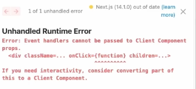

# 5. NextJS Sidebar

## Goal
- 더미 데이터를 셋팅 합니다.  

### 복습 포인트

SideBar 컴포넌트 직접 만들어 보기    


## 5.1 더미 데이터 넣기

아래 깃허브 저장소를 참고한다.  
- https://github.com/dodokyo/yt-music-clone  
- git clone을 받자.!  
- public의 로고, 이미지, 음악 파일을 복사한다.   


*위 디렉터리 + 파일들을 넣어주세요.!  

## 5.2 Sidebar


## 5.3 Sidebar > Logo

### 설명하기  

왜 아래 오류가 나왔을까요? 해결 방법은요?  



## 5.4 Sidebar > Navigator


## 5.5 Sidebar > PlayList


## 고도화 - ERD 다이어그램 만들기  

더미데이터로 DB Table을 만든다면 그 관계구조도는 어떻게 될까요? 
  
위 그림처럼 간단하게라도 데이터의 구조를 파악해 보세요.  

## 고도화 - MockServer 만들기  

더미데이터를 내려주는 Express API 서버를 하나 만들면 어떨까요?  
간단한 REST API 만드실 수 있다라면 금방 할 것 같아요.!  
NextJS에서 저희가 만든 API 서버로 요청을 보내도 좋습니다.!  

힌트)

아래는 Express를 사용하여 간단한 REST API를 구현하는 예제 코드입니다.

```javascript
const express = require('express');
const bodyParser = require('body-parser');

const app = express();
const port = 3000;

// JSON 파싱을 위한 미들웨어 추가
app.use(bodyParser.json());

// 간단한 메모장 데이터베이스 역할을 할 배열
let memos = [];

// 모든 메모를 반환하는 엔드포인트
app.get('/api/memos', (req, res) => {
  res.json(memos);
});

// 특정 ID의 메모를 반환하는 엔드포인트
app.get('/api/memos/:id', (req, res) => {
  const id = parseInt(req.params.id);
  const memo = memos.find(memo => memo.id === id);
  if (memo) {
    res.json(memo);
  } else {
    res.status(404).json({ message: '메모를 찾을 수 없습니다.' });
  }
});

// 새로운 메모를 추가하는 엔드포인트
app.post('/api/memos', (req, res) => {
  const memo = req.body;
  memos.push(memo);
  res.status(201).json(memo);
});

// 기존 메모를 수정하는 엔드포인트
app.put('/api/memos/:id', (req, res) => {
  const id = parseInt(req.params.id);
  const updatedMemo = req.body;
  const index = memos.findIndex(memo => memo.id === id);
  if (index !== -1) {
    memos[index] = updatedMemo;
    res.json(updatedMemo);
  } else {
    res.status(404).json({ message: '메모를 찾을 수 없습니다.' });
  }
});

// 특정 ID의 메모를 삭제하는 엔드포인트
app.delete('/api/memos/:id', (req, res) => {
  const id = parseInt(req.params.id);
  const index = memos.findIndex(memo => memo.id === id);
  if (index !== -1) {
    memos.splice(index, 1);
    res.sendStatus(204);
  } else {
    res.status(404).json({ message: '메모를 찾을 수 없습니다.' });
  }
});

// 서버 시작
app.listen(port, () => {
  console.log(`서버가 http://localhost:${port} 에서 실행 중입니다.`);
});
```

위의 코드는 Express를 사용하여 메모장 데이터를 관리하는 간단한 RESTful API를 만드는 것입니다. 이 코드를 실행하면 서버가 3000번 포트에서 실행되며, /api/memos 엔드포인트로 메모를 관리할 수 있습니다.

## 체크포인트 코드  

https://github.com/dodokyo/yt-music-clone/tree/ch5-done

